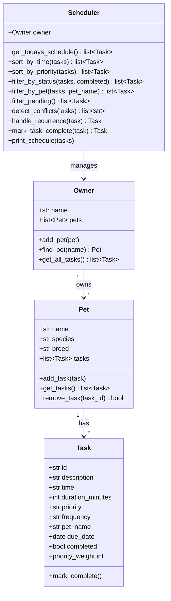

# PawPal+ UML Class Diagram

## Relationships

- **Owner → Pet**: One owner can have many pets (`add_pet`, `find_pet`).
- **Pet → Task**: Each pet holds its own task list (`add_task`, `get_tasks`, `remove_task`).
- **Scheduler → Owner**: The Scheduler holds a reference to the Owner and traverses pets to collect all tasks.

## Design Notes

- `Task` is a Python dataclass for clean initialization with default values.
- `Pet` is a dataclass whose `tasks` field is a mutable list (not shared across instances thanks to `field(default_factory=list)`).
- `Scheduler` is a plain class — it coordinates logic but does not own data; data lives in `Owner` and `Pet`.
- Conflict detection uses exact-minute matching as a deliberate tradeoff (see reflection.md § 2b).
